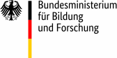
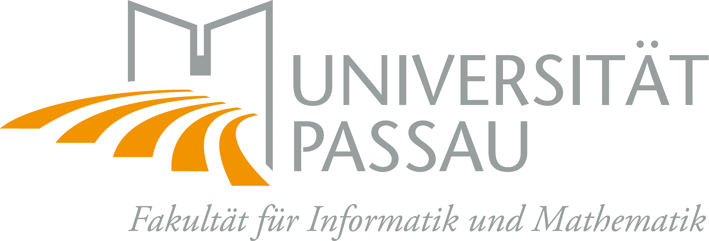
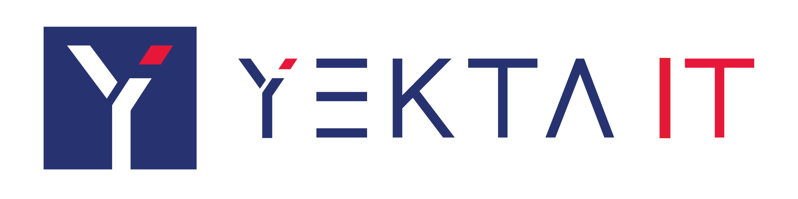

Gefördert vom

{: width="150"}

 
 

[{: width="250"}](https://incyde.com)

Die INCYDE industrial cyber defense GmbH (INCYDE), mit Sitz in Berlin, Frankfurt und München hat sich auf die Analyse, Lösungserarbeitung und Umsetzung von Security-Bedarfen im Bereich operativer Technologien in den Bereichen Eisenbahn- und Energietechnik spezialisiert.
INCYDE führt die Security Cluster Spezifikationen der europäischen Initiativen EULYNX und RCA und ist bei OCORA beteiligt.
Ihre Mitarbeiter sind für Spezifikation der ATO Security für das Projekt Digitale Schiene Hamburg verantwortlich gewesen und aktuell für ATO Security des Digitalen Knoten Stuttgart verantwortlich.
INCYDE gestaltet das DZSF-Projekt „Prognose Securitybedarf und Bewertung möglicher Sicherheitskonzepte für das System Bahn“ und ist heute für die Deutsche Bahn bestellt, gutachterlich die Security-Konzepte für das digitale Stellwerk und bahnbetriebliches IP-Netz zu bewerten.
Für das Security Operations Center im Kontext EULYNX und Deutsche Bahn erfolgte die risikobasierte Ableitung der Use-Cases, die Korrelationslogik und Spezifikation der Komponentenfähigkeiten zur Umsetzung der Security-Strategie.
Wir gehen davon aus, die umfassenden Kenntnisse und Erfahrungen für die erfolgreiche Steuerung des Projekts und nutzergerechte Gestaltung der Architektur, Analytik und Anwendung einbringen zu können und so die Grundlage für eine schnelle Marktreife für Bahn und Autoindustrie zu legen.

 

{: width="250"}

 

### Fraunhofer-Institut für Sichere Informationstechnologie

 

[{: width="250"}](https://www.fim.uni-passau.de/technische-informatik/)

 

[{: width="250"}](https://yekta-it.de/)

 

### DB Systemtechnik GmbH
